# 🔐 Trusted Publishing Setup for NuGet.org

**Secure, keyless authentication for publishing packages from GitHub Actions**

---

## 🎯 What is Trusted Publishing?

Trusted Publishing uses **OpenID Connect (OIDC)** to authenticate GitHub Actions workflows directly with NuGet.org, eliminating the need for API keys.

**Benefits:**
- ✅ **No secrets to manage** - No API keys in GitHub Secrets
- ✅ **More secure** - Short-lived tokens, no long-term credentials
- ✅ **Automatic** - GitHub Actions gets access via OIDC
- ✅ **Zero-trust** - NuGet.org verifies workflow identity
- ✅ **Audit trail** - Full transparency on who/what published

---

## 🚀 Setup Steps

### 1. Configure NuGet.org

**Prerequisites:**
- Package must already exist on NuGet.org
- You must be package owner

**Steps:**

1. **Go to package management page:**
   ```
   https://www.nuget.org/packages/Mcp.Gateway.Tools/manage
   ```

2. **Click "Trusted Publishers" tab**

3. **Click "Add" button**

4. **Fill in the form:**
   - **Package owner:** `eyjolfurgudnivatne` (your GitHub username or org)
   - **Repository owner:** `eyjolfurgudnivatne`
   - **Repository name:** `mcp.gateway`
   - **Workflow file:** `.github/workflows/release.yml`
   - **Environment:** (leave empty, or use `production` for extra security)

5. **Click "Add"**

6. **Verify** - You should see the trusted publisher listed

---

### 2. Update GitHub Actions Workflow

**File:** `.github/workflows/release.yml`

**Required permissions:**
```yaml
permissions:
  contents: write   # For creating releases
  packages: write   # For publishing packages
  id-token: write   # For Trusted Publishing (OIDC) ← REQUIRED!
```

**Publish step:**
```yaml
- name: Publish to NuGet.org
  run: |
    dotnet nuget push ./nupkgs/*.nupkg \
      --source https://api.nuget.org/v3/index.json \
      --skip-duplicate
```

**Note:** No `--api-key` parameter needed! 🎉

---

## ✅ Verification

### Test with Prerelease

**Safe way to test Trusted Publishing:**

```bash
# Create prerelease tag
git tag v1.1.0-beta
git push origin v1.1.0-beta
```

**Expected behavior:**
- ✅ Workflow runs
- ✅ Tests pass
- ✅ Package is built
- ✅ GitHub Release created
- ❌ **NOT published to NuGet** (prerelease condition)

**Check workflow logs:**
```
https://github.com/eyjolfurgudnivatne/mcp.gateway/actions
```

### Test with Stable Release

**After prerelease test succeeds:**

```bash
# Delete beta tag (optional)
git tag -d v1.1.0-beta
git push origin :refs/tags/v1.1.0-beta

# Create stable tag
git tag v1.1.0
git push origin v1.1.0
```

**Expected behavior:**
- ✅ Workflow runs
- ✅ Tests pass
- ✅ Package is built
- ✅ GitHub Release created
- ✅ **Published to NuGet.org** via Trusted Publishing!

---

## 🔍 How It Works

### OIDC Authentication Flow

```mermaid
sequenceDiagram
    participant GHA as GitHub Actions
    participant OIDC as GitHub OIDC Provider
    participant NuGet as NuGet.org
    
    GHA->>OIDC: Request ID token
    OIDC->>GHA: Return ID token (short-lived)
    GHA->>NuGet: Push package + ID token
    NuGet->>NuGet: Verify token claims
    NuGet->>NuGet: Match trusted publisher config
    NuGet->>GHA: Package accepted ✅
```



**Token Claims Verified:**
- Repository owner
- Repository name
- Workflow file path
- Environment (if specified)
- Branch/tag

**Security:**
- Token is valid for ~10 minutes only
- Cannot be reused
- Specific to workflow run

---

## 🐛 Troubleshooting

### "Authentication failed" Error

**Possible causes:**

1. **Trusted Publisher not configured**
   - Go to: https://www.nuget.org/packages/Mcp.Gateway.Tools/manage
   - Check "Trusted Publishers" tab
   - Verify configuration matches workflow

2. **Missing `id-token: write` permission**
   ```yaml
   permissions:
     id-token: write  # ← REQUIRED!
   ```

3. **Wrong workflow file path**
   - Must match exactly: `.github/workflows/release.yml`
   - Case-sensitive!

4. **Environment mismatch**
   - If you specified environment in trusted publisher config
   - Workflow must run in that environment

### "Package already exists" Error

**This is normal!** Use `--skip-duplicate`:
```yaml
dotnet nuget push ./nupkgs/*.nupkg \
  --source https://api.nuget.org/v3/index.json \
  --skip-duplicate  # ← Skip if version exists
```

### Verify OIDC Token

**Enable debug logging:**

1. Go to: https://github.com/eyjolfurgudnivatne/mcp.gateway/settings/actions
2. Enable "Actions runner debug logging"
3. Re-run workflow
4. Check logs for OIDC token details

---

## 🔄 Migration from API Keys

### Step 1: Setup Trusted Publishing

Follow setup steps above ☝️

### Step 2: Test with Prerelease

Verify Trusted Publishing works before removing API key.

### Step 3: Remove API Key (Optional)

**After successful test:**

1. **Remove GitHub Secret:**
   - Go to: https://github.com/eyjolfurgudnivatne/mcp.gateway/settings/secrets/actions
   - Delete `NUGET_API_KEY` secret

2. **Revoke NuGet API key:**
   - Go to: https://www.nuget.org/account/apikeys
   - Delete old API key

**Note:** Keep API key as fallback initially if desired.

---

## 📚 Additional Resources

### Environment-Based Publishing (Advanced)

**Use GitHub Environments for extra security:**

**1. Create environment:**
   - Go to: https://github.com/eyjolfurgudnivatne/mcp.gateway/settings/environments
   - Create environment: `production`
   - Add protection rules:
     - ✅ Required reviewers
     - ✅ Wait timer
     - ✅ Branch protection

**2. Update trusted publisher config:**
   - Environment: `production`

**3. Update workflow:**
   ```yaml
   jobs:
     release:
       environment: production  # ← Use environment
   ```

**Benefits:**
- Manual approval required before publish
- Extra security layer
- Audit trail

---

## 🎯 Best Practices

### 1. Use Prerelease for Testing

```bash
# Test Trusted Publishing with prerelease first
git tag v1.1.0-rc1
git push origin v1.1.0-rc1
```

### 2. Monitor First Few Releases

Check workflow logs to ensure Trusted Publishing works correctly.

### 3. Document Configuration

Keep note of:
- Repository owner/name
- Workflow file path
- Environment (if used)

### 4. Keep API Key as Backup (Initially)

Don't delete API key immediately - keep as fallback for first few releases.

---

## 📖 Official Documentation

- [NuGet Trusted Publishing](https://learn.microsoft.com/en-us/nuget/nuget-org/publish-a-package#trusted-publishing)
- [GitHub OIDC](https://docs.github.com/en/actions/deployment/security-hardening-your-deployments/about-security-hardening-with-openid-connect)
- [Azure DevOps Trusted Publishing](https://learn.microsoft.com/en-us/nuget/nuget-org/publish-a-package#azure-devops-pipelines)

---

**Created:** 5. desember 2025  
**Status:** Recommended for all new workflows  
**Security:** ✅ Zero-trust, keyless authentication

